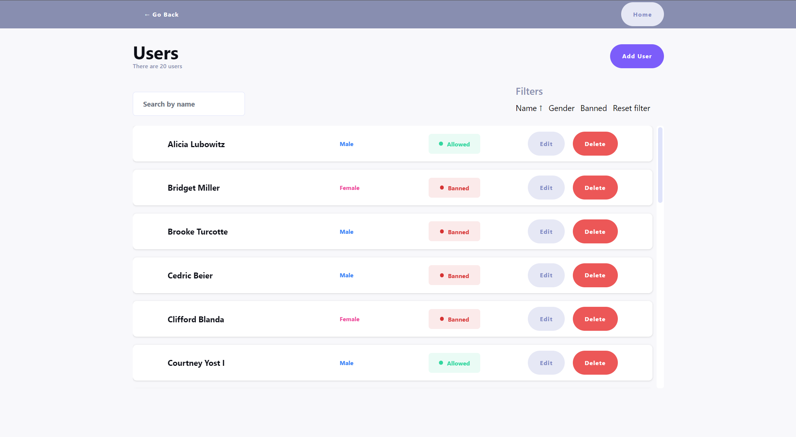

# User and Animal Management Web Application

This project is a web application built to manage users and animals using a simple REST API. The application allows interaction with these two entities through client-side fetching and data manipulation.

## Table of Contents

- [Overview](#overview)
  - [The Challenge](#the-challenge)
  - [Screenshot](#screenshot)
- [My Process](#my-process)
  - [Built With](#built-with)
- [Deployment](#deployment)
- [Author](#author)

## Overview

### The Challenge

The goal of this project is to showcase proficiency in creating a web application using React and TypeScript to interact with a REST API that manages user and animal entities. The application meets the following requirements:

- Users page:

  - Fetch and display a list of users from the API.
  - Filter users by name.
  - Clear the filter with a button.
  - Add new users using a form.
  - Mark users as banned.
  - Edit user details.

- Animals page:

  - Fetch and display a list of animals from the API.
  - Filter animals by name.
  - Clear the filter with a button.
  - Add new animals using a form.
  - Edit animal details.

- Additional requirements:
  - Client-side data fetching preferred over server-side rendering.
  - Responsive design with a focus on usability.

### Screenshot

## My Process

### Built With

- [React](https://reactjs.org/) - JavaScript Library
- [TypeScript](https://www.typescriptlang.org/) - Typed JavaScript
- [Tailwind CSS](https://tailwindcss.com/) - Utility-first CSS Framework
- [React Final Form](https://final-form.org/react) - Form State Management
- [React Query](https://react-query.tanstack.com/) - Data Fetching and Caching
- [Yup](https://github.com/jquense/yup) - Data Validation Library
- [Axios](https://axios-http.com/) - HTTP Client
- [Lodash](https://lodash.com/) - Utility Functions Library
- [ESLint](https://eslint.org/) - Linting Tool
- [Prettier](https://prettier.io/) - Code Formatter
- [Vite](https://vitejs.dev/) - Build Tool

## Deployment

To run the project locally, follow these steps:

1. Clone the repository.
2. Install dependencies with `npm install`.
3. Run the development server with `npm run dev`.
4. Open `http://localhost:5173/` in your browser to view the application.

## Author

- GitHub - [Marek Vcelak](https://github.com/VcelakMarek)
- LinkedIn - [Marek Vcelak](https://www.linkedin.com/in/marek-v%C4%8Del%C3%A1k-6176bb1b0/)
